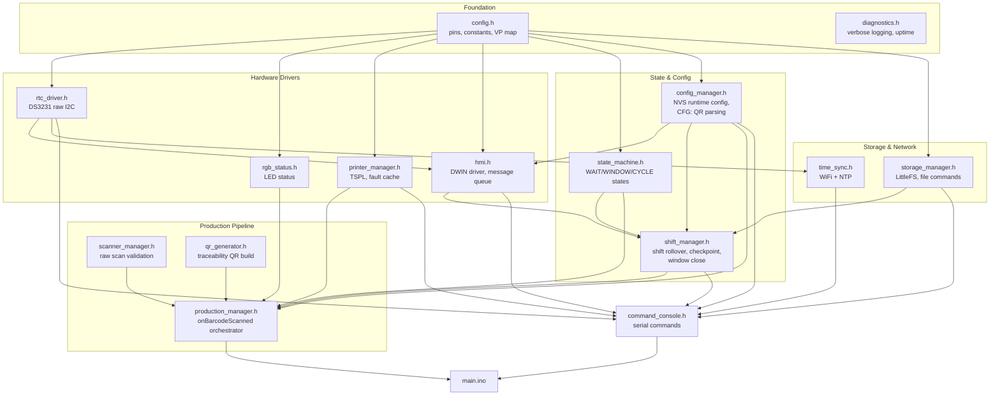
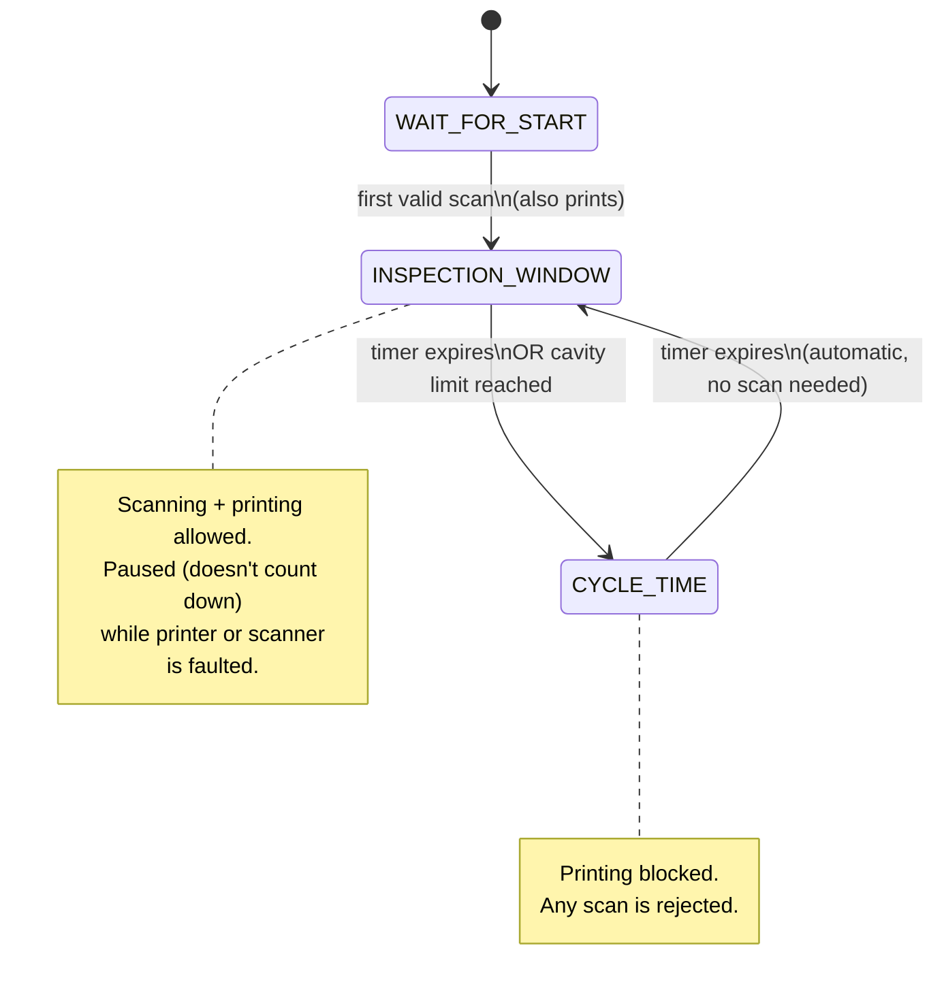
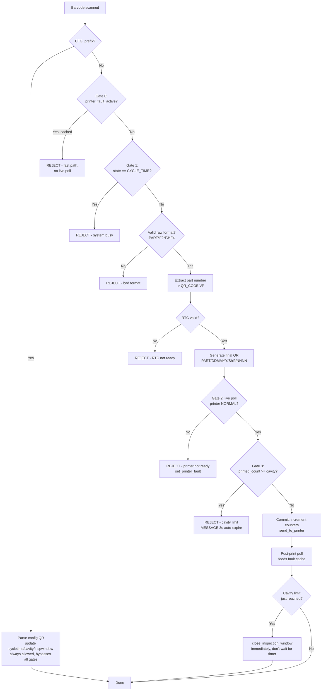

# Industrial QR Traceability Controller

Firmware for an ESP32-S3 based traceability controller: scans a raw-material QR code,
generates a traceability label, prints it via RS232, tracks OK/NG production statistics
per shift, and displays live status on a DWIN HMI touchscreen.

## Hardware

| Component | Interface | Notes |
|---|---|---|
| ESP32-S3 | — | Main controller |
| DS3231 RTC | I2C (`SDA_PIN=42`, `SCL_PIN=2`) | Battery-backed real time clock |
| USB HID barcode scanner | USB Host | Raw material QR input |
| RS232 label printer | UART (`Serial2`, `PTR_TX=35`, `PTR_RX=17`) | TSPL command set |
| DWIN HMI (DGUS) | UART (`DWIN_TX_PIN=37`, `DWIN_RX_PIN=36`) | Operator display, `115200` baud |
| RGB status LED | `RGB_LED_PIN=15` | WS2812-style, NeoPixel |

## Firmware architecture

### Declaration/implementation split

As of v2.0.0, every module above is a declarations-only `.h` (types, `extern`
globals, function prototypes) paired with a matching `.cpp` (the actual
definitions), instead of a header with the full implementation inline. Two
reasons this mattered enough to do as its own pass:

- **Correctness.** Header-defined globals/functions only worked because the
  Arduino build concatenates every `.ino`/`.h` into a single translation
  unit - anything included more than once, or split across real `.cpp`
  files, would have violated the One Definition Rule. Splitting into real
  declaration/definition pairs makes that concern go away for good, and
  forces every module to explicitly `#include` what it actually uses instead
  of silently relying on some other module having pulled it in first. Doing
  this surfaced a real bug: `command_console.h` calls `poll_printer_status()`,
  `set_printer_fault()`, `send_to_printer()`, `printer_status_to_text()`, and
  reads `printer_fault_active` - all from `printer_manager.h` - without ever
  including it. It only compiled because `main.ino` happened to include
  `printer_manager.h` before `command_console.h`. That's now a real,
  explicit `#include "printer_manager.h"` in `command_console.h` (and the
  diagram above now shows that edge, which it was missing).
- **Encapsulation.** Several globals turned out to be used by exactly one
  module and nothing else (e.g. the HMI condition registry storage, the
  shift-rollover deferral state, `printer_port`, `build_tspl_qr_job()`,
  `filename_is_safe()`). Those are now `static` inside their `.cpp` -
  genuinely private, not just conventionally private - instead of being
  global mutable state every other file could technically reach into.

One caveat worth knowing: this split was done without access to a compiler
in the environment it was written in (no network access to install the
ESP32 toolchain), so unlike the smaller fixes before it, it could not be
build-verified before being handed over. Every `extern`/prototype pair was
manually cross-checked to have exactly one matching definition, in the
correct module, with matching default arguments (C++ requires those live
only in the declaration, never repeated in the definition) - but a first
real compile on your machine is the actual proof. If it doesn't compile
cleanly, the errors should be localized and easy to place (a missing
`#include` in one header, most likely) rather than systemic, given how this
was built up module-by-module against a verified dependency map.

## Production state machine

## Scan processing pipeline (`onBarcodeScanned`)

Every raw scan passes through a sequence of gates before a label is printed.

## HMI (DWIN DGUS) — VP address map

All fields are **Text**-type widgets. Every write goes through `hmi_write_text()`, which
blanks the field before writing (prevents stale trailing characters) and always uses
`Write_UString` (never `Write_Number` — mixing encodings on a Text widget renders garbage).

| VP | Field | Content |
|---|---|---|
| `0x5000` | QR_CODE | Extracted part number from the last scan (never the full generated QR) |
| `0x5500` | MESSAGE | Highest-priority active condition (see below) |
| `0x5600` | PRINT_COUNTER | OK count for the current cycle/window |
| `0x5650` | STICKER | OK count, shift-wise (running total) |
| `0x5700` | MOLD_CAVITY | Configured cavity count |
| `0x5750` | SCANNER_STATUS | `Connected` / `Disconnected` only |
| `0x5800` | PRINTER_STATUS | `Connected` / `Disconnected` only (fault detail goes to MESSAGE, not here) |

### MESSAGE condition registry

The MESSAGE line is driven by a small fixed set of named "conditions," each with its own
active/severity/text. The display always shows the highest-severity **active** condition;
when it clears, the next-highest active one shows automatically.

| Condition | Severity | Behavior |
|---|---|---|
| `HMI_COND_ROUTINE` | 0 | Always active — normal state text (e.g. "Inspection Window Open") |
| `HMI_COND_REJECT` | 1 | Transient (cavity limit reached) — auto-expires after 3s |
| `HMI_COND_SCANNER` | 2 | Persists until scanner reconnects — pauses window, beeps buzzer |
| `HMI_COND_PRINTER` | 3 | Persists until printer fault clears — pauses window, beeps buzzer |

Buzzer fires only for severity ≥ `HMI_COND_SCANNER` (the two faults that stop production
entirely) — not for routine state changes or transient rejects.

## Traceability QR format

**Input (raw material scan):** `PART*FIELD2*FIELD3*FIELD4` — asterisk-delimited, exactly
4 segments.

**Output (generated label):** `PART/DDMMYY/Shift/NNNN`
Example: `1063NRF26/030826/B/0008`

**Config QR (engineer/operator settings):** `CFG:CVT:<n>,CYCT:<min>,INPT:<min>`
Any subset of the three keys, comma-separated, colon-separated key:value. `CVT` = cavity
count (raw integer). `CYCT`/`INPT` = cycle time / inspection window, in **minutes**,
converted to seconds internally. Example: `CFG:CVT:8,CYCT:5,INPT:1`. Bypasses all
production-state gates — always processed immediately, even if the printer is faulted or
the system is busy. Generate the QR from any online QR generator with this exact text as
the payload.

## Storage (LittleFS)

| File | Written | Purpose |
|---|---|---|
| `/stats/MMYY.csv` | On shift rollover (~2×/day) | Finalized history: `DD,shift,ok,ng` per line |
| `/stats/current.ckp` | Every window close | In-progress shift checkpoint, for power-loss recovery |

A shift's date is anchored to when it **started**, so a night shift crossing midnight is
recorded under the date it began, matching the original spec's convention.

## Web portal (dashboard over a WiFi hotspot)

`webportal start` (console command) turns the device into its own WiFi access point and
starts an HTTP dashboard on it - separate from the station-mode WiFi in `time_sync.h`,
which *connects to* an existing network for NTP; this one makes the device *become* a
network for local monitoring.

**There is no login on the console or the web portal.** Both were removed deliberately at
the project owner's request, trading the protections below for simplicity:

- Any command works over serial immediately, with no `login`/password step - anyone with a
  USB cable has full access (`config`, `resetdata`, `setconfig`, everything) the moment they
  open a terminal.
- The dashboard has no login form - anyone who connects to the AP hotspot sees it
  immediately. The only barrier is knowing `AP_SSID`/`AP_PASSWORD` (hardcoded in
  `secrets.h`, WPA2-protected at the WiFi layer, but not gated by anything past that).
- `AP_SSID`/`AP_PASSWORD` are compiled-in constants, not NVS-stored or changeable from any
  command - edit `secrets.h` and reflash to change them.
- The dashboard itself is read-only (status only) in this build - no config/file/resetdata
  controls are exposed over HTTP.
- Uses the **built-in `WebServer.h`** (part of the ESP32 Arduino core, no library install
  needed) - not ESPAsyncWebServer/AsyncTCP, which crashed on this project's ESP-IDF 5.x
  (esp32 core 3.3.6) with `assert failed: tcp_alloc ... Required to lock TCPIP core
  functionality!`, a known incompatibility not fixed by every AsyncTCP/ESPAsyncWebServer
  version combination. `WebServer.h` runs entirely synchronously from `loop()` via
  `webportal_service()`'s `server.handleClient()` call - no separate task, so that class of
  bug can't happen. Tradeoff: `loop()` blocks a few ms while actively handling a request.
- `reboot` (console command) restarts the device via `ESP.restart()`.

**`secrets.h`** (gitignored, see `secrets.h.example` for the template) holds the default
WiFi station SSID/password (seeded to NVS on first `wifi`/`timesync` use) and the hotspot's
`AP_SSID`/`AP_PASSWORD`. If you clone this repo fresh, copy `secrets.h.example` to
`secrets.h` and fill in real values before building - the build fails on the missing
`#include` otherwise, on purpose, so a fresh checkout can't accidentally ship with a
placeholder.

One related bug fixed while wiring up WiFi credential loading: `wifi_ssid`/`wifi_pass` were
previously never actually loaded from NVS at boot (the `Preferences` object was never even
`.begin()`'d until the `wifi` command ran) — so credentials set via `wifi <ssid>
<password>` silently didn't survive a reboot. `wifi_creds_load()`, called once from
`setup()`, now loads them from NVS (seeding from `secrets.h`'s defaults on the very first
boot only) the same way `load_config_from_nvs()` already did for the runtime config.

## Serial command reference

| Command | Description |
|---|---|
| `webportal start` \| `stop` \| `status` | Start/stop the web dashboard hotspot (no login) |
| `reboot` | Restart the device |
| `settime YYYY MM DD HH MM SS` | Manual RTC set, no WiFi needed (verified via read-back) |
| `wifi <ssid> <password>` | Store WiFi credentials in NVS (does not connect) |
| `timesync` | Connect, fetch NTP, write RTC, then WiFi off |
| `listfiles` | List `/stats` files |
| `getfile <filename>` | Dump contents of a `/stats` file over Serial |
| `stats` | Show current (not-yet-finalized) shift totals |
| `config` | Show current runtime configuration |
| `setconfig <key> <value>` | Change + persist one config value (`cycletime`, `inspwindow`, `cavity`, `shift_a`, `shift_b`; shift keys accept `HH:MM`, e.g. `7:30`) |
| `resetconfig` | Reset config to compiled-in defaults |
| `version` | Show firmware version and build date |
| `resetdata` | Requires `resetdata CONFIRM` to actually wipe `/stats` |
| `hmitext <vp_hex> <text>` | Write text to a VP address (calibration) |
| `hmiwrite <vp_hex> <number>` | Write a number to a VP address (calibration) |
| `hmihelp` | HMI-focused help |
| `verbose on` / `off` | Toggle extra diagnostic logging |
| `uptime` | Time since boot |
| `help` | Full command list |

Robust against any terminal line-ending setting — completes a command on `\n`, `\r`, or
after 200ms of silence if neither ever arrives.

## Key design decisions

- **LittleFS, not SPIFFS or FFat** — better power-loss tolerance for the checkpoint file,
  which is rewritten every window close.
- **Two-tier fault detection (Gate #0 / Gate #2)** — a cached `printer_fault_active` flag
  gives fast-path rejection without polling on every scan; the live poll immediately before
  printing (Gate #2) remains the actual safety authority regardless of the cache.
- **Window pause on printer/scanner fault** — an outage doesn't silently burn cavities into
  NG just because the countdown kept running while nothing could be scanned or printed.
- **Deferred shift rollover** — a shift boundary crossed while a window is open doesn't reset
  totals out from under it; the rollover applies right after that window's counts are folded
  in and checkpointed.
- **Config QR bypasses all gates** — a settings change is orthogonal to production state;
  gating it behind printer health specifically makes no sense since it never touches the
  printer.
- **Hardware watchdog (`watchdog.h`)** — armed at the end of `setup()`, fed once at the top
  of every `loop()` pass. If `loop()` ever fails to return (e.g. a hang in a blocking UART
  wait), the chip resets itself instead of sitting frozen on the shop floor until someone
  notices and power-cycles it. Armed *after* the LittleFS mount/format step, not before,
  since a first-boot format can legitimately take longer than the timeout.
- **Background printer poll is non-blocking** — the periodic health poll in `loop()`
  (every `PRINTER_POLL_INTERVAL_MS`/`PRINTER_FAULT_POLL_INTERVAL_MS`, forever) now kicks
  off the request and returns immediately instead of spinning for up to
  `PRINTER_REPLY_TIMEOUT_MS`; `bg_poll_printer_status_service()` picks up the reply (or
  timeout) on a later pass. The boot check, the console `printer status` command, and the
  pre/post-print checks in `production_manager.h` are unchanged and still block briefly —
  those are one-off, user- or scan-triggered, not a constant per-pass cost, and touching
  them would mean restructuring the scan pipeline itself. `poll_printer_status()` resets
  any in-flight background poll before it runs, so the two never read each other's replies.
- **`String` removed from all long-lived/hot-path storage** — `hmi_condition_t.text` is now
  a fixed `char[HMI_CONDITION_TEXT_LEN]`, and `hmi_condition_set()` takes `const char*` and
  copies via `strncpy` instead of allocating. This matters most for the printer-fault path
  (`set_printer_fault()`): it used to build a `String` via `+` concatenation on every poll
  cycle - every 150-500ms for as long as a fault was active - which is exactly the kind of
  repeated heap churn that fragments an ESP32's heap over a long production run. That's now
  a `snprintf` into a stack buffer. `storage_manager.h`'s `resetdata` file-collection also
  moved off `String[64]` for the same reason, though it's rare/deliberate, not a hot path.
  What's *not* changed, and can't be without its source: `hmi.Write_UString()` is a
  third-party library call (`dwindisplay.h`) that only accepts a `String`, per the comment
  at the top of `hmi.h` - every numeric/text value written to a VP still goes through one
  `String(...)` conversion right at that call. Those are single, bounded, immediately-freed
  allocations, not accumulating ones, so they're a much smaller risk than what was fixed
  here - but they're a real remaining constraint, not a false alarm, if `dwindisplay`'s
  source ever becomes available to patch too.