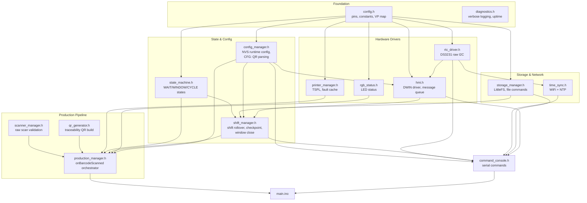
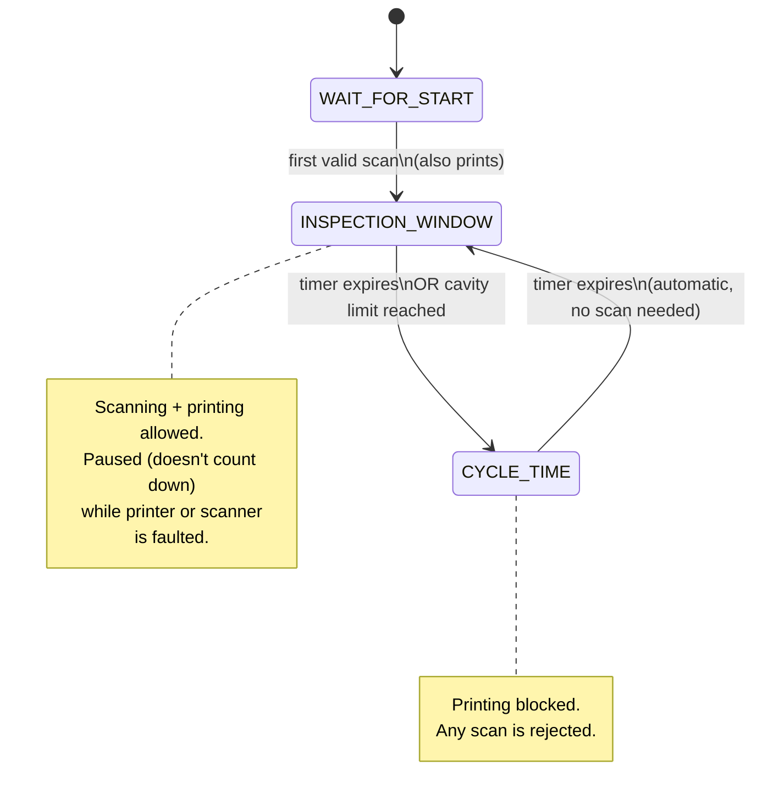
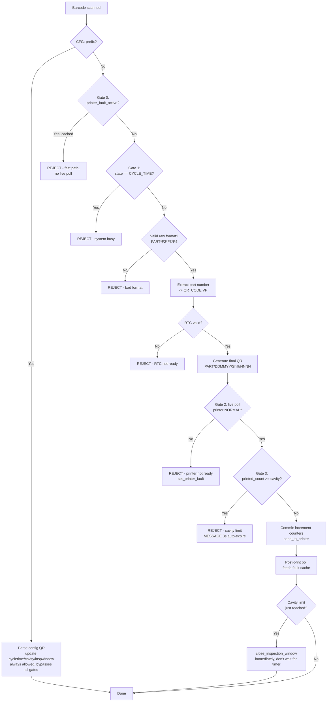

# Industrial QR Traceability Controller

Firmware for an ESP32-S3 based traceability controller: scans a raw-material QR code,
generates a traceability label, prints it via RS232, tracks OK/NG production statistics
per shift, and displays live status on a DWIN HMI touchscreen.

## Hardware

| Component | Interface | Notes |
|---|---|---|
| ESP32-S3 | — | Main controller |
| DS3231 RTC | I2C (`SDA_PIN=42`, `SCL_PIN=2`) | Battery-backed real time clock |
| USB HID barcode scanner | USB Host | Raw material QR input |
| RS232 label printer | UART (`Serial2`, `PTR_TX=35`, `PTR_RX=17`) | TSPL command set |
| DWIN HMI (DGUS) | UART (`DWIN_TX_PIN=37`, `DWIN_RX_PIN=36`) | Operator display, `115200` baud |
| RGB status LED | `RGB_LED_PIN=15` | WS2812-style, NeoPixel |

## Firmware architecture

Single `.ino` sketch split into header-only modules (no `.cpp` files — every function/global
is defined once and only ever included into one translation unit, so plain `#ifndef` guards
are sufficient without `inline`). `main.ino` includes every module and contains only
`setup()`/`loop()`.

## Production state machine

## Scan processing pipeline (`onBarcodeScanned`)

Every raw scan passes through a sequence of gates before a label is printed.

## HMI (DWIN DGUS) — VP address map

All fields are **Text**-type widgets. Every write goes through `hmi_write_text()`, which
blanks the field before writing (prevents stale trailing characters) and always uses
`Write_UString` (never `Write_Number` — mixing encodings on a Text widget renders garbage).

| VP | Field | Content |
|---|---|---|
| `0x5000` | QR_CODE | Extracted part number from the last scan (never the full generated QR) |
| `0x5500` | MESSAGE | Highest-priority active condition (see below) |
| `0x5600` | PRINT_COUNTER | OK count for the current cycle/window |
| `0x5650` | STICKER | OK count, shift-wise (running total) |
| `0x5700` | MOLD_CAVITY | Configured cavity count |
| `0x5750` | SCANNER_STATUS | `Connected` / `Disconnected` only |
| `0x5800` | PRINTER_STATUS | `Connected` / `Disconnected` only (fault detail goes to MESSAGE, not here) |

### MESSAGE condition registry

The MESSAGE line is driven by a small fixed set of named "conditions," each with its own
active/severity/text. The display always shows the highest-severity **active** condition;
when it clears, the next-highest active one shows automatically.

| Condition | Severity | Behavior |
|---|---|---|
| `HMI_COND_ROUTINE` | 0 | Always active — normal state text (e.g. "Inspection Window Open") |
| `HMI_COND_REJECT` | 1 | Transient (cavity limit reached) — auto-expires after 3s |
| `HMI_COND_SCANNER` | 2 | Persists until scanner reconnects — pauses window, beeps buzzer |
| `HMI_COND_PRINTER` | 3 | Persists until printer fault clears — pauses window, beeps buzzer |

Buzzer fires only for severity ≥ `HMI_COND_SCANNER` (the two faults that stop production
entirely) — not for routine state changes or transient rejects.

## Traceability QR format

**Input (raw material scan):** `PART*FIELD2*FIELD3*FIELD4` — asterisk-delimited, exactly
4 segments.

**Output (generated label):** `PART/DDMMYY/Shift/NNNN`
Example: `1063NRF26/030826/B/0008`

**Config QR (engineer/operator settings):** `CFG:cycletime=<min>,cavity=<n>,inspwindow=<min>`
Any subset of the three keys, comma-separated. Values for time are in **minutes**, converted
to seconds internally. Bypasses all production-state gates — always processed immediately,
even if the printer is faulted or the system is busy.

## Storage (LittleFS)

| File | Written | Purpose |
|---|---|---|
| `/stats/MMYY.csv` | On shift rollover (~2×/day) | Finalized history: `DD,shift,ok,ng` per line |
| `/stats/current.ckp` | Every window close | In-progress shift checkpoint, for power-loss recovery |

A shift's date is anchored to when it **started**, so a night shift crossing midnight is
recorded under the date it began, matching the original spec's convention.

## Serial command reference

| Command | Description |
|---|---|
| `settime YYYY MM DD HH MM SS` | Manual RTC set, no WiFi needed (verified via read-back) |
| `wifi <ssid> <password>` | Store WiFi credentials in NVS (does not connect) |
| `timesync` | Connect, fetch NTP, write RTC, then WiFi off |
| `listfiles` | List `/stats` files |
| `getfile <filename>` | Dump contents of a `/stats` file over Serial |
| `stats` | Show current (not-yet-finalized) shift totals |
| `config` | Show current runtime configuration |
| `setconfig <key> <value>` | Change + persist one config value (`cycletime`, `inspwindow`, `cavity`, `shift_a`, `shift_b`) |
| `resetconfig` | Reset config to compiled-in defaults |
| `version` | Show firmware version and build date |
| `resetdata` | Requires `resetdata CONFIRM` to actually wipe `/stats` |
| `hmitext <vp_hex> <text>` | Write text to a VP address (calibration) |
| `hmiwrite <vp_hex> <number>` | Write a number to a VP address (calibration) |
| `hmihelp` | HMI-focused help |
| `verbose on` / `off` | Toggle extra diagnostic logging |
| `uptime` | Time since boot |
| `help` | Full command list |

Robust against any terminal line-ending setting — completes a command on `\n`, `\r`, or
after 200ms of silence if neither ever arrives.

## Key design decisions

- **LittleFS, not SPIFFS or FFat** — better power-loss tolerance for the checkpoint file,
  which is rewritten every window close.
- **Two-tier fault detection (Gate #0 / Gate #2)** — a cached `printer_fault_active` flag
  gives fast-path rejection without polling on every scan; the live poll immediately before
  printing (Gate #2) remains the actual safety authority regardless of the cache.
- **Window pause on printer/scanner fault** — an outage doesn't silently burn cavities into
  NG just because the countdown kept running while nothing could be scanned or printed.
- **Deferred shift rollover** — a shift boundary crossed while a window is open doesn't reset
  totals out from under it; the rollover applies right after that window's counts are folded
  in and checkpointed.
- **Config QR bypasses all gates** — a settings change is orthogonal to production state;
  gating it behind printer health specifically makes no sense since it never touches the
  printer.